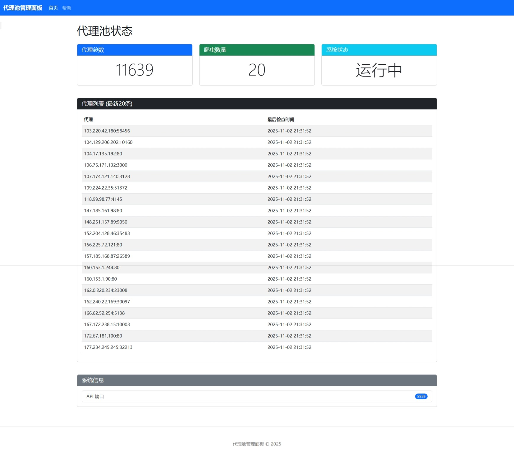
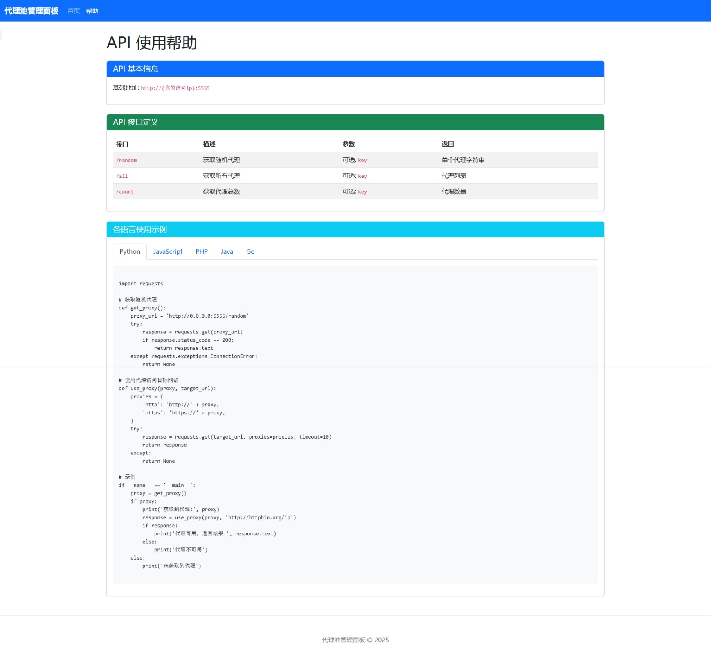

# 🌐 ProxyPool


## 📊 系统展示

### 管理页面首页


### 插件管理页面


### 帮助页面


✨ 简易高效的代理池，提供如下功能：

- 🔄 定时抓取免费代理网站，简易可扩展。
- 📦 使用 Redis 对代理进行存储并对代理可用性进行排序。
- 🔍 定时测试和筛选，剔除不可用代理，留下可用代理。
- 🚀 提供代理 API，随机取用测试通过的可用代理。
- 🔌 插件化爬虫管理，动态加载和展示爬虫插件，并可显示插件序号、名称和来源（公共/私有）。

📚 代理池原理解析可见「[如何搭建一个高效的代理池](https://cuiqingcai.com/7048.html)」，建议使用之前阅读。

## 📝 更新日志

### 📅 2025-11-02 更新
- 🐛 修复了管理面板中 `now` 过滤器未定义的问题
- 🐛 修复了时区参数类型错误问题
- 🗑️ 移除了管理面板中的代理分数栏目显示
- 🗑️ 移除了管理面板中的 API 主机显示
- 🗑️ 移除了管理面板中的 Redis 主机和 Redis 端口显示
- 🔄 更新了帮助页面中的基础地址显示格式

## ⚠️ 使用前注意

⚠️ 本代理池是基于市面上各种公开代理源搭建的，所以可用性并不高，很可能上百上千个代理中才能找到一两个可用代理，不适合直接用于爬虫爬取任务。

如果您的目的是为了尽快使用代理完成爬取任务，建议您对接一些付费代理或者直接使用已有代理资源；如果您的目的是为了学习如何搭建一个代理池，您可以参考本项目继续完成后续步骤。

💰 付费代理推荐：

- 📞 [ADSL 拨号代理](https://platform.acedata.cloud/documents/a82a528a-8e32-4c4c-a9d0-a21be7c9ef8c)：海量拨号（中国境内）高质量代理
- 🌍 [海外/全球代理](https://platform.acedata.cloud/documents/50f1437a-1857-43c5-85cf-5800ae1b31e4)：中国境外高质量代理
- 📱 [蜂窝 4G/5G 代理](https://platform.acedata.cloud/documents/1cc59b19-1550-4169-a59d-ad6faf7f7517)：极高质量（中国境内）防风控代理

## 🔧 使用准备

🔽 首先当然是克隆代码并进入 ProxyPool 文件夹：

```
git clone https://github.com/498330580/ProxyPool.git
cd ProxyPool
```

然后选用下面 Docker 和常规方式任意一个执行即可。

## 📋 使用要求

可以通过两种方式来运行代理池，一种方式是使用 Docker（推荐），另一种方式是常规方式运行，要求如下：

### 🐳 Docker

如果使用 Docker，则需要安装如下环境：

- 🐳 Docker
- 🔄 Docker-Compose

安装方法自行搜索即可。

🔗 官方 Docker Hub 镜像：[germey/proxypool](https://hub.docker.com/r/germey/proxypool)

### 💻 常规方式

常规方式要求有 Python 环境、Redis 环境，具体要求如下：

- 🐍 Python>=3.10
- 📦 Redis

### ⚙️ GitHub Actions

本项目使用 [GitHub Actions](https://github.com/features/actions) 进行持续集成和部署。工作流配置文件位于 `.github/workflows` 目录下。

## 🐳 Docker 运行

如果安装好了 Docker 和 Docker-Compose，只需要一条命令即可运行。

```shell
docker-compose up
```

运行结果类似如下：

```
redis        | 1:M 19 Feb 2020 17:09:43.940 * DB loaded from disk: 0.000 seconds
redis        | 1:M 19 Feb 2020 17:09:43.940 * Ready to accept connections
proxypool    | 2020-02-19 17:09:44,200 CRIT Supervisor is running as root.  Privileges were not dropped because no user is specified in the config file.  If you intend to run as root, you can set user=root in the config file to avoid this message.
proxypool    | 2020-02-19 17:09:44,203 INFO supervisord started with pid 1
proxypool    | 2020-02-19 17:09:45,209 INFO spawned: 'getter' with pid 10
proxypool    | 2020-02-19 17:09:45,212 INFO spawned: 'server' with pid 11
proxypool    | 2020-02-19 17:09:45,216 INFO spawned: 'tester' with pid 12
proxypool    | 2020-02-19 17:09:46,596 INFO success: getter entered RUNNING state, process has stayed up for > than 1 seconds (startsecs)
proxypool    | 2020-02-19 17:09:46,596 INFO success: server entered RUNNING state, process has stayed up for > than 1 seconds (startsecs)
proxypool    | 2020-02-19 17:09:46,596 INFO success: tester entered RUNNING state, process has stayed up for > than 1 seconds (startsecs)
```

可以看到 Redis、Getter、Server、Tester 都已经启动成功。

这时候访问 [http://localhost:5555/random](http://localhost:5555/random) 即可获取一个随机可用代理。

如果下载速度特别慢，可以自行修改 Dockerfile，修改：

```diff
- RUN pip install -r requirements.txt
+ RUN pip install -r requirements.txt -i https://pypi.douban.com/simple
```

## 💻 常规方式运行

如果不使用 Docker 运行，配置好 Python、Redis 环境之后也可运行，步骤如下。

### 🔧 安装和配置 Redis

本地安装 Redis、Docker 启动 Redis、远程 Redis 都是可以的，只要能正常连接使用即可。

首先可以需要一下环境变量，代理池会通过环境变量读取这些值。

设置 Redis 的环境变量有两种方式，一种是分别设置 host、port、password，另一种是设置连接字符串，设置方法分别如下：

设置 host、port、password，如果 password 为空可以设置为空字符串，示例如下：

```shell script
export PROXYPOOL_REDIS_HOST='localhost'
export PROXYPOOL_REDIS_PORT=6379
export PROXYPOOL_REDIS_PASSWORD=''
export PROXYPOOL_REDIS_DB=0
```

或者只设置连接字符串：

```shell script
export PROXYPOOL_REDIS_CONNECTION_STRING='redis://localhost'
```

这里连接字符串的格式需要符合 `redis://[:password@]host[:port][/database]` 的格式，
中括号参数可以省略，port 默认是 6379，database 默认是 0，密码默认为空。

以上两种设置任选其一即可。

### 📦 安装依赖包

这里强烈推荐使用 [Conda](https://docs.conda.io/projects/conda/en/latest/user-guide/tasks/manage-environments.html#creating-an-environment-with-commands)
或 [virtualenv](https://virtualenv.pypa.io/en/latest/user_guide.html) 创建虚拟环境，Python 版本不低于 3.6。

然后 pip 安装依赖即可：

```shell script
pip3 install -r requirements.txt
```

### 🚀 运行代理池

两种方式运行代理池，一种是 Tester、Getter、Server 全部运行，另一种是按需分别运行。

一般来说可以选择全部运行，命令如下：

```shell script
python run.py
```

运行之后会启动 Tester、Getter、Server，这时访问 [http://localhost:5555/random](http://localhost:5555/random) 即可获取一个随机可用代理。

或者如果你弄清楚了代理池的架构，可以按需分别运行，命令如下：

```shell script
python run.py --processor getter
python run.py --processor tester
python run.py --processor server
```

这里 processor 可以指定运行 Tester、Getter 还是 Server。

## 🔍 使用

成功运行之后可以通过 [http://localhost:5555/random](http://localhost:5555/random) 获取一个随机可用代理。

可以用程序对接实现，下面的示例展示了获取代理并爬取网页的过程：

```python
import requests

proxypool_url = 'http://127.0.0.1:5555/random'
target_url = 'http://httpbin.org/get'

def get_random_proxy():
    """
    get random proxy from proxypool
    :return: proxy
    """
    return requests.get(proxypool_url).text.strip()

def crawl(url, proxy):
    """
    use proxy to crawl page
    :param url: page url
    :param proxy: proxy, such as 8.8.8.8:8888
    :return: html
    """
    proxies = {'http': 'http://' + proxy}
    return requests.get(url, proxies=proxies).text


def main():
    """
    main method, entry point
    :return: none
    """
    proxy = get_random_proxy()
    print('get random proxy', proxy)
    html = crawl(target_url, proxy)
    print(html)

if __name__ == '__main__':
    main()
```

运行结果如下：

```
get random proxy 116.196.115.209:8080
{
  "args": {},
  "headers": {
    "Accept": "*/*",
    "Accept-Encoding": "gzip, deflate",
    "Host": "httpbin.org",
    "User-Agent": "python-requests/2.22.0",
    "X-Amzn-Trace-Id": "Root=1-5e4d7140-662d9053c0a2e513c7278364"
  },
  "origin": "116.196.115.209",
  "url": "https://httpbin.org/get"
}
```

可以看到成功获取了代理，并请求 httpbin.org 验证了代理的可用性。

## 🔌 API 接口

代理池提供基于 HTTP 的简易接口，默认监听 `API_HOST=0.0.0.0`、`API_PORT=5555`。

- 📍 基础地址
  - `http://{你的访问ip}:5555`

- 🔑 公共查询参数
  - `key`：可选，指定 Redis 子池键名（如：`proxies:weibo`）；未设置时使用默认池。

- 📋 接口列表
  - `GET /`：健康检查/欢迎页
    - 返回：`text/html`，示例：`<h2>Welcome to Proxy Pool System</h2>`
  - `GET /random`：获取一个随机可用代理
    - 参数：`key`（可选）
    - 返回：`text/plain`，内容形如：`<host>:<port>`
    - 说明：若指定 `key` 的子池为空且 `PROXY_RAND_KEY_DEGRADED=true`，会回退到通用池；否则可能报错。
  - `GET /all`：获取所有可用代理（按行分隔）
    - 参数：`key`（可选）
    - 返回：`text/plain`，多行，每行一个 `host:port`
  - `GET /count`：获取当前可用代理数量
    - 参数：`key`（可选）
    - 返回：`text/plain`，示例：`123`

- 📝 示例
  - 获取随机代理：
    - `curl http://localhost:5555/random`
  - 指定子池获取随机代理：
    - `curl "http://localhost:5555/random?key=proxies:weibo"`
  - 获取全部代理：
    - `curl http://localhost:5555/all`
  - 获取代理数量：
    - `curl http://localhost:5555/count`


### ⚙️ 开关

- 🔄 ENABLE_TESTER：允许 Tester 启动，默认 true
- 🔄 ENABLE_GETTER：允许 Getter 启动，默认 true
- 🔄 ENABLE_SERVER：运行 Server 启动，默认 true

### 🌐 环境

- 🏠 APP_ENV：运行环境，可以设置 dev、test、prod，即开发、测试、生产环境，默认 dev
- 🐞 APP_DEBUG：调试模式，可以设置 true 或 false，默认 true
- 🚀 APP_PROD_METHOD: 正式环境启动应用方式，默认是`gevent`，
  可选：`tornado`，`meinheld`（分别需要安装 tornado 或 meinheld 模块）

### 📦 Redis 连接

- 🖥️ PROXYPOOL_REDIS_HOST / REDIS_HOST：Redis 的 Host，其中 PROXYPOOL_REDIS_HOST 会覆盖 REDIS_HOST 的值。
- 🔌 PROXYPOOL_REDIS_PORT / REDIS_PORT：Redis 的端口，其中 PROXYPOOL_REDIS_PORT 会覆盖 REDIS_PORT 的值。
- 🔑 PROXYPOOL_REDIS_PASSWORD / REDIS_PASSWORD：Redis 的密码，其中 PROXYPOOL_REDIS_PASSWORD 会覆盖 REDIS_PASSWORD 的值。
- 🔢 PROXYPOOL_REDIS_DB / REDIS_DB：Redis 的数据库索引，如 0、1，其中 PROXYPOOL_REDIS_DB 会覆盖 REDIS_DB 的值。
- 🔗 PROXYPOOL_REDIS_CONNECTION_STRING / REDIS_CONNECTION_STRING：Redis 连接字符串，其中 PROXYPOOL_REDIS_CONNECTION_STRING 会覆盖 REDIS_CONNECTION_STRING 的值。
- 🏷️ PROXYPOOL_REDIS_KEY / REDIS_KEY：Redis 储存代理使用字典的名称，其中 PROXYPOOL_REDIS_KEY 会覆盖 REDIS_KEY 的值。

### ⚙️ 处理器

- ⏱️ CYCLE_TESTER：Tester 运行周期，即间隔多久运行一次测试，默认 20 秒
- ⏱️ CYCLE_GETTER：Getter 运行周期，即间隔多久运行一次代理获取，默认 100 秒
- 🔗 TEST_URL：测试 URL，默认百度
- ⏱️ TEST_TIMEOUT：测试超时时间，默认 10 秒
- 🔢 TEST_BATCH：批量测试数量，默认 20 个代理
- 🔢 TEST_VALID_STATUS：测试有效的状态码
- 🖥️ API_HOST：代理 Server 运行 Host，默认 0.0.0.0
- 🔌 API_PORT：代理 Server 运行端口，默认 5555
- 🧵 API_THREADED：代理 Server 是否使用多线程，默认 true

### 📝 日志

- 📁 LOG_DIR：日志相对路径，默认 logs，默认 logs
- 📄 LOG_RUNTIME_FILE：运行日志文件名称
- 📄 LOG_ERROR_FILE：错误日志文件名称
- 🔄 LOG_ROTATION: 日志记录周转周期或大小，默认 500MB，见 [loguru - rotation](https://github.com/Delgan/loguru#easier-file-logging-with-rotation--retention--compression)
- 📅 LOG_RETENTION: 日志保留日期，默认 7 天，见 [loguru - retention](https://github.com/Delgan/loguru#easier-file-logging-with-rotation--retention--compression)
- ✅ ENABLE_LOG_FILE：是否输出 log 文件，默认 true，如果设置为 false，那么 ENABLE_LOG_RUNTIME_FILE 和 ENABLE_LOG_ERROR_FILE 都不会生效
- ✅ ENABLE_LOG_RUNTIME_FILE：是否输出 runtime log 文件，默认 true
- ✅ ENABLE_LOG_ERROR_FILE：是否输出 error log 文件，默认 true

以上内容均可使用环境变量配置，即在运行前设置对应环境变量值即可，如更改测试地址和 Redis 键名：

```shell script
export TEST_URL=http://weibo.cn
export REDIS_KEY=proxies:weibo
```

即可构建一个专属于微博的代理池，有效的代理都是可以爬取微博的。

如果使用 Docker-Compose 启动代理池，则需要在 docker-compose.yml 文件里面指定环境变量，如：

```yaml
version: "3"
services:
  redis:
    image: redis:alpine
    container_name: redis
    command: redis-server
    restart: always
  proxypool:
    build: .
    image: "germey/proxypool"
    container_name: proxypool
    ports:
      - "5555:5555"
    volumes:
      - ./proxypool/crawlers/private:/app/proxypool/crawlers/private
      - ./logs:/app/logs
    restart: always
    environment:
      PROXYPOOL_REDIS_HOST: redis
```

## 🔧 扩展代理爬虫

代理的爬虫均放置在 proxypool/crawlers 文件夹下，目前对接了有限几个代理的爬虫。

若扩展一个爬虫，只需要在 crawlers 文件夹下新建一个 Python 文件声明一个 Class 即可。

写法规范如下：

```python
from pyquery import PyQuery as pq
from proxypool.schemas.proxy import Proxy
from proxypool.crawlers.base import BaseCrawler

BASE_URL = 'http://www.664ip.cn/{page}.html'
MAX_PAGE = 5

class Daili66Crawler(BaseCrawler):
    """
    daili66 crawler, http://www.66ip.cn/1.html
    """
    urls = [BASE_URL.format(page=page) for page in range(1, MAX_PAGE + 1)]

    def parse(self, html):
        """
        parse html file to get proxies
        :return:
        """
        doc = pq(html)
        trs = doc('.containerbox table tr:gt(0)').items()
        for tr in trs:
            host = tr.find('td:nth-child(1)').text()
            port = int(tr.find('td:nth-child(2)').text())
            yield Proxy(host=host, port=port)
```

在这里只需要定义一个 Crawler 继承 BaseCrawler 即可，然后定义好 urls 变量和 parse 方法即可。

- urls 变量即为爬取的代理网站网址列表，可以用程序定义也可写成固定内容。
- parse 方法接收一个参数即 html，代理网址的 html，在 parse 方法里只需要写好 html 的解析，解析出 host 和 port，并构建 Proxy 对象 yield 返回即可。

网页的爬取不需要实现，BaseCrawler 已经有了默认实现，如需更改爬取方式，重写 crawl 方法即可。

欢迎大家多多发 Pull Request 贡献 Crawler，使其代理源更丰富强大起来。

## 📄 LICENSE

MIT
